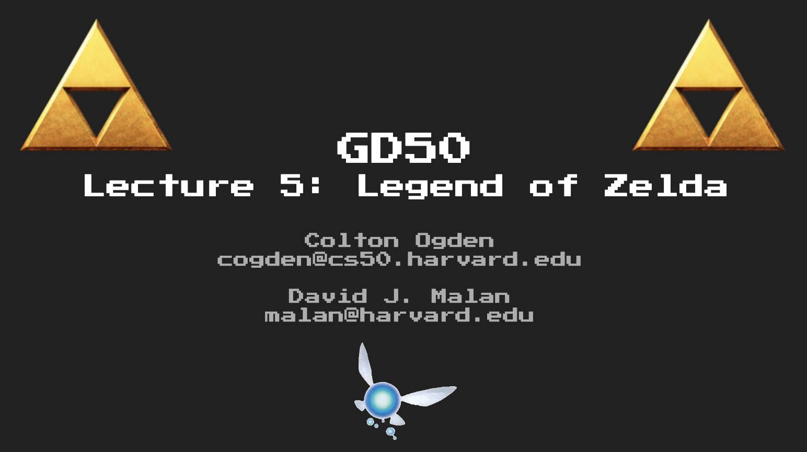
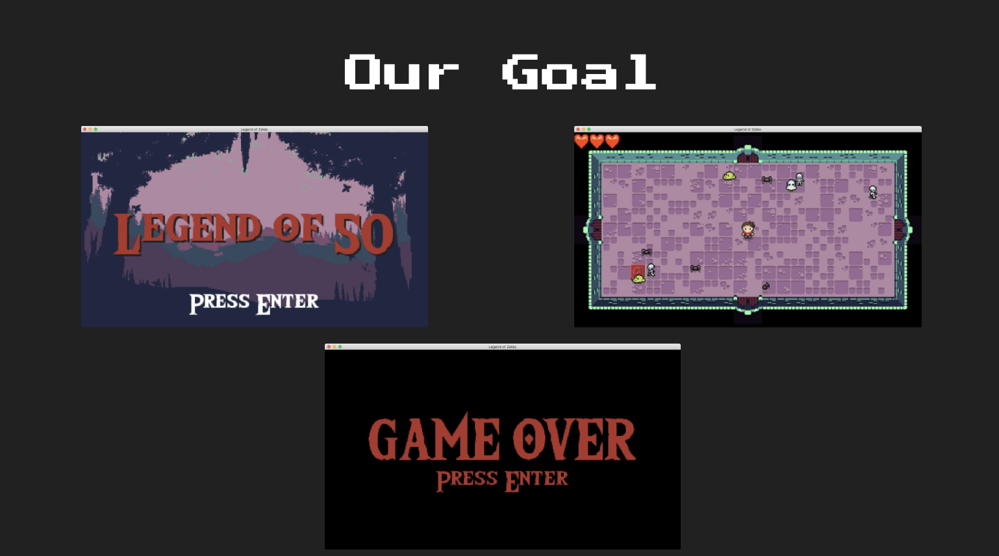
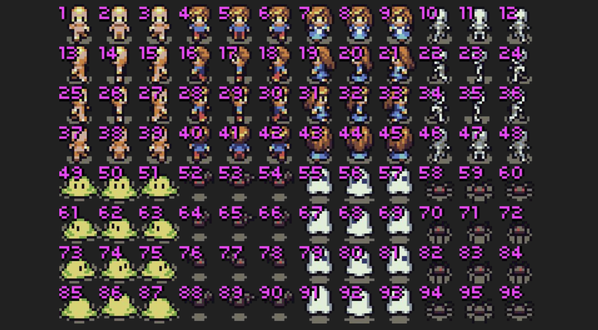
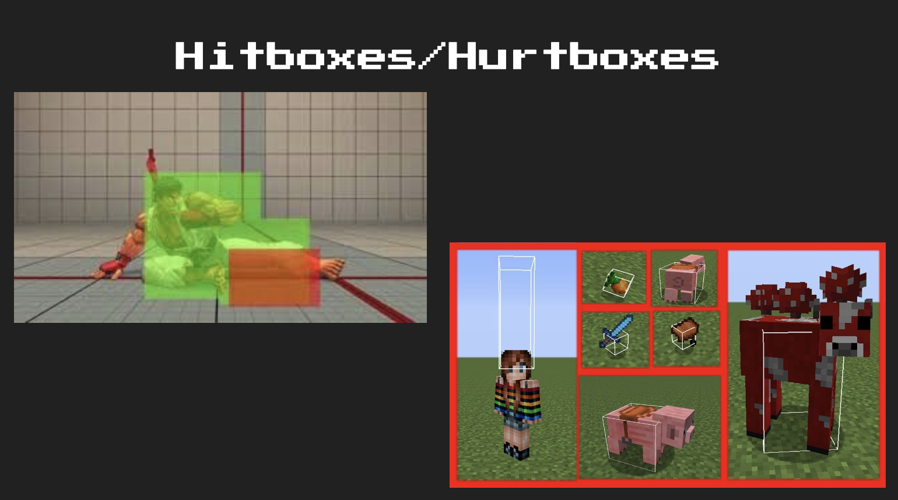
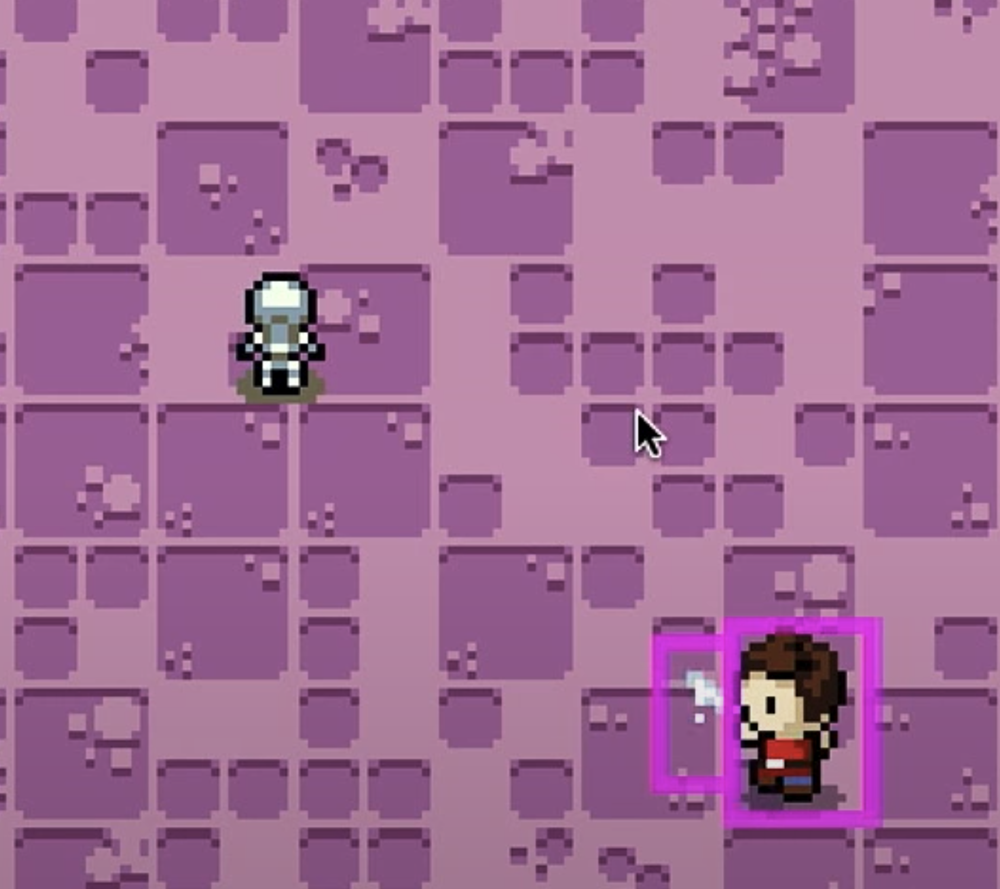
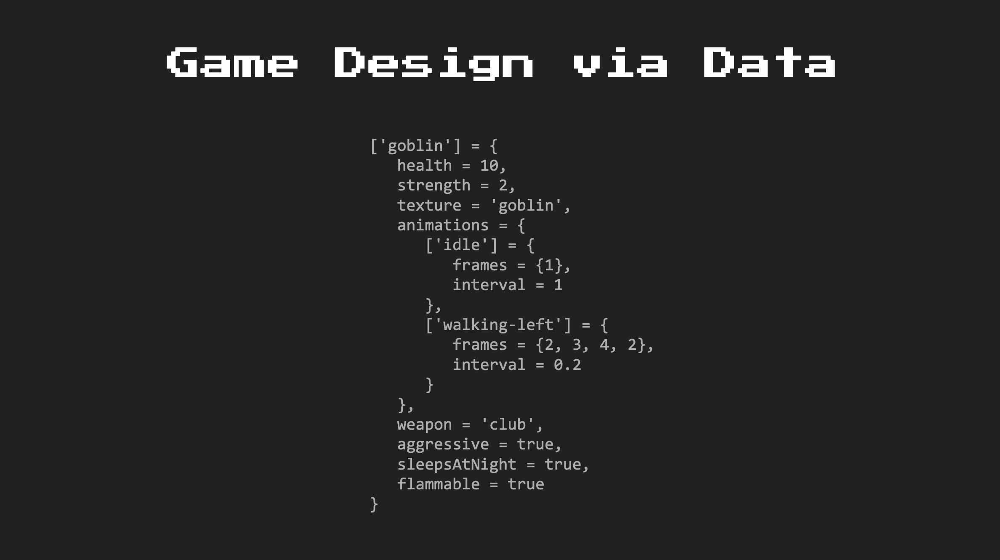
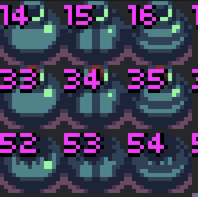
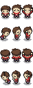
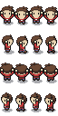

# GD50-legend-of-zelda
*The Legend Of Zelda* has been one of the greatest series in the adventure game genre. Its "Open World" free to explore concept, dungeon design, puzzles and unique boss fights were all ground breaking at the time and these excellent ideas and design process of a game has been so significant and effective in creating a well structured game while still giving the player enough freedom and hidden secrets for pace control.


Lecture Notes: [Lecture 5](https://github.com/jazorhe/GD50-legend-of-zelda/blob/main/lecture5.pdf)




### Overview
-   [Our Goal](#our-goal)
-   [Lecture Notes](#lecture-notes)
-   [Assignment](#assignment)
-   [Submission](#submission)
-   [Useful Links](#useful-links)


<br>

## Our Goal
Our goal this time is to create a game demo with the same top-down perspective world. The game includes auto generated dungeon rooms that will fill up the entire screen size and allow player to travel back and forth between the rooms. There will be enemies in the room to fight, and also switches in the room to unlock doors. Player will have a certain amount of health and when being attacked by an enemy, the player will lose health points and when health reaches 0, it is game over.




## Lecture Notes
**Topics**:
-   [Top-Down Perspective](#top-down-perspective)
-   [Infinite Dungeon Generation](#infinite-dungeon-generation)
-   [Hitboxes/Hurtboxes](#hitboxeshurtboxes)
-   [Events](#events)
-   [Screen Scrolling](#screen-scrolling)
-   [Data-Driven Design](#data-driven-design)

### Top-Down Perspective
Art style:
-   Remember when creating all art assets that everything has to be drawn with a top down perspective, including all characters and entities
-   Remember to draw the corners of the assets properly for them to look convincing.
-   Creating shadows on objects is an important way to make the top-down perspective look good
-   With assets that are more than one tile, rendering and collision boxes needs to be taken cared of separately.





*Nice trick: It is a good idea to write a little script to number your sprite sheets.*


### Infinite Dungeon Generation
Room Transition:
-   `self.nextRoom = nil`, set to new `Room()` when player collides with a door
-   Need to know which door the play has collided with
-   Place the new room at one screen space across to that direction and **tween** the two rooms against the transition direciton
-   At last, `self.currentRoom = self.nextRoom`, and set its position back at `x = 0` and `y = 0` so that coordinate systems in other calculations are still valid
-   Stencil: when player walks on the stencil areas, do not render player (for items overlay each other purposes)


Room Rendering:
-   Draw corners, sides with x, y tracking
-   Draw floors with random texture
-   Offset room so its at the center of the screen

Enemies and Switches:
-   Enemies are entites
-   All enemies are sequences of data


### Hitboxes/Hurtboxes
As hitboxes touches hurtboxes, deal damage to entity. In this game, we need a hitbox for our sword because of the following reasons:
-   We need to account for which direction the player is facing
-   Player's body box will be the hurtbox not the hitbox

  


A good way to debug, which is also widely used, is to draw coloured line rectangles to represent the hitboxes and hurtboxes:

  


### Events
Events are particular things that happen in the game which triggers a block of codes. Usually the block of code can be abstracted and stored in a separate location, keeping the details that are unrelated to the major game code apart form the main game logic. A good representation would be the achievement system, where on can trigger an onEvent() function and store a variable else where, which can be accessed by the achievement system. Where the achievement system can then decide if the player has unlocked a new achievement without having to write the bunch of if statements in the main game logic, also without having to call a check achievement function in every update loop.

In here, we make use of the Event library from the Knife module.

#### Event Functions
-   `Event.on(name, callback)`
    -   Calls `callback`, which is a function, whenever the message by its `name` is dispatched via `Event.dispatch`.
-   `Event.dispatch(name, [params])`
    -   Calls the callback function registered to `name`, set by `Event.on`, with some optional `params` that will be sent to that callback function as arguments.


### Screen Scrolling
We perform following:
-   If player collides with an open door
    -   Dispatch room shifting event, event is handled by Dungeon.lua
        -   Set shift and new positions
        -   Tween
        -   Reset all points to 0, 0 coordinates


#### Stencil Functions
Stencils are used before collision happens:
-   `love.graphics.stencil(func, [action], [value], [keepvals])`
    -   Performs all stencil drawing within `func`; anything drawn during that time will act as the stencil pixels during `love.graphics.setStencilTest`. `action` defines how those pixels will behave with pixels drawn onto them during `love.graphics.setStencilTest`, while `value` is the value `action` is reliant upon.
-   `love.graphics.setStencilTest(compare_mode, compare_value)`
    -   Compares pixels drawn via `compare_mode` with that of `compare_value`, only drawing pixels whose results of this mode is true.


### Data-Driven Design
The main idea is to compose the entities with attributes and model its behaviour that way. Without having to manage a bunch of classes where each has their own behaviours. **Composition over Inheritance!**


  


In the above example, besides the `entity_defs.lua`, one could also have a `weapon_defs.lua` and with attributes of weapons stored within the file. Thus a `['goblin']` would have a `weapon = 'club'`, which its attributes can be loaded together when the goblin is spawned.


### Other Notes
NES Homebrew
<http://wiki.nesdev.com/w/index.php/Nesdev_Wiki><br>
<http://wiki.nesdev.com/w/index.php/Programming_guide><br>  
<http://wiki.nesdev.com/w/index.php/Installing_CC65><br>


<br>

## Assignment
### Objectives
-   [x] [**Code Reading**](#code-reading)Read and understand all of the Legend of Zelda source code from Lecture 5.
    -   [x] [`main.lua`](#mainlua)
    -   [x] [`Dependencies.lua`, `constants.lua` and `Util.lua`](#dependencieslua-constantslua-and-utillua)
    -   [x] [`Entity.lua`, `entity_def.lua`, `GameObject.lua` and `game_objects.lua`](#entitylua-entity_deflua-gameobjectlua-and-game_objectslua)
    -   [x] [`Player.lua`, `Animation.lua` and `Hitbox.lua`](#playerlua-animationlua-and-hitboxlua)
    -   [x] [`Projectile.lua`](#projectilelua)
    -   [x] [`StateMachine.lua` and GameStates](#statemachinelua-and-gamestates)
    -   [x] [PlayerStates and EntityStates](#playerstates-and-entitystates)
    -   [x] [World: `Doorway.lua`, `Dungeon.lua` and `Room.lua`](#world-doorwaylua-dungeonlua-and-roomlua)


-   [x] [**Regaining Health**](#regaining-health): Implement hearts that sometimes drop from enemies at random, which will heal the player for a full heart when picked up (consumed).

-   [x] [**Pots and Carrying Pots**](#pots-and-carrying-pots): Add pots to the game world (from the tile sheet) at random that the player can pick up, at which point their animation will change to reflect them carrying the pot (shown in the character sprite sheets). The player should not be able to swing their sword when in this state.

-   [x] [**Throwing Pots**](#throwing-pots): When carrying a pot, the player should be able to throw the pot. When thrown, the pot will travel in a straight line based on where the player is looking. When it collides with a wall, travels more than four tiles, or collides with an enemy, it should disappear. When it collides with an enemy, it should do 1 point of damage to that enemy as well.


<br>

### Code Reading
#### `main.lua`
As we have seen in previous assignments, `main.lua` has been designed to be minimum and only have the essential like declaring window, resizing, keyboard handling, and a simple update, a simple draw function that passes the heavy-lifting to other classes.


#### `Dependencies.lua`, `constants.lua` and `Util.lua`
-   `Dependencies.lua`: Same old story, let's also move gStateMachines here.
-   `constant.lua`: Variables for Map offset and Map sizes

```lua
MAP_WIDTH = VIRTUAL_WIDTH / TILE_SIZE - 2
MAP_HEIGHT = math.floor(VIRTUAL_HEIGHT / TILE_SIZE) - 2

MAP_RENDER_OFFSET_X = (VIRTUAL_WIDTH - (MAP_WIDTH * TILE_SIZE)) / 2
MAP_RENDER_OFFSET_Y = (VIRTUAL_HEIGHT - (MAP_HEIGHT * TILE_SIZE)) / 2
```

#### `Entity.lua`, `entity_def.lua`, `GameObject.lua` and `game_objects.lua`
AABB with some slight shrinkage of the box on the top side for perspective.

```lua
function Entity:collides(target)
    return not (self.x + self.width < target.x or self.x > target.x + target.width or
                self.y + self.height < target.y or self.y > target.y + target.height)
end
```


Below are really nice abstraction for an entity's behaviour:

```lua
function Entity:changeState(name)
    self.stateMachine:change(name)
end

function Entity:changeAnimation(name)
    self.currentAnimation = self.animations[name]
end
```


Also allow entity to have an AI:

```lua
function Entity:processAI(params, dt)
    self.stateMachine:processAI(params, dt)
end
```


Game Object rendering in short but simple instruction:

```lua
function GameObject:render(adjacentOffsetX, adjacentOffsetY)
    love.graphics.draw(gTextures[self.texture], gFrames[self.texture][self.states[self.state].frame or self.frame],
        self.x + adjacentOffsetX, self.y + adjacentOffsetY)
end
```


#### `Player.lua`, `Animation.lua` and `Hitbox.lua`
These have now become simple classes, especially the Player class, it would work like it has inherited from the entity class, it is probably a good idea to also put player into the `entity_defs.lua`. Because the State Machine handles all interactive behaviours of the player (at least in this example).


#### `Projectile.lua`
This is for implementing pot throwing in the assignment.


#### `StateMachine.lua` and GameStates
Nothing much has changed except stateMachine also have the ability to handle AI processing:

```lua
function StateMachine:processAI(params, dt)
	self.current:processAI(params, dt)
end
```


#### PlayerStates and EntityStates
Also simple and elegant because everything has been abstracted away.

<https://love2d.org/wiki/love.graphics.push>
```lua
love.graphics.push()
self.dungeon:render()
love.graphics.pop()
```

#### World: `Doorway.lua`, `Dungeon.lua` and `Room.lua`
`Doorway.lua` is simply drawing the doors.

`Dungeon.lua` is for screen scrolling during room translation. `Dungeon.lua` has Events, Tweening, camera translations and reset.

`Room.lua` holds entites, gameobjects, doors and tiles. A bit like the level we had in mario. `Room.lua` also deals with Stencils.

```lua
-- stencil out the door arches so it looks like the player is going through
love.graphics.stencil(function()
    -- left
    love.graphics.rectangle('fill', -TILE_SIZE - 6, MAP_RENDER_OFFSET_Y + (MAP_HEIGHT / 2) * TILE_SIZE - TILE_SIZE,
        TILE_SIZE * 2 + 6, TILE_SIZE * 2)

    -- right
    love.graphics.rectangle('fill', MAP_RENDER_OFFSET_X + (MAP_WIDTH * TILE_SIZE) - 6,
        MAP_RENDER_OFFSET_Y + (MAP_HEIGHT / 2) * TILE_SIZE - TILE_SIZE, TILE_SIZE * 2 + 6, TILE_SIZE * 2)

    -- top
    love.graphics.rectangle('fill', MAP_RENDER_OFFSET_X + (MAP_WIDTH / 2) * TILE_SIZE - TILE_SIZE,
        -TILE_SIZE - 6, TILE_SIZE * 2, TILE_SIZE * 2 + 12)

    --bottom
    love.graphics.rectangle('fill', MAP_RENDER_OFFSET_X + (MAP_WIDTH / 2) * TILE_SIZE - TILE_SIZE,
        VIRTUAL_HEIGHT - TILE_SIZE - 6, TILE_SIZE * 2, TILE_SIZE * 2 + 12)
end, 'replace', 1)

love.graphics.setStencilTest('less', 1)

if self.player then
    self.player:render()
end

love.graphics.setStencilTest()
```

### Regaining Health
*Implement hearts that sometimes drop from vanquished enemies at random, which will heal the player for a full heart when picked up (consumed). Much of this we’ve already done in Super Mario Bros., so feel free to reuse some of the code in there! Recall that all `Entities` have a `health` field, including the `Player`. The `Player`’s health is measured numerically but represented via hearts; note that he can have half-hearts, which means that each individual heart should be worth 2 points of damage. Therefore, when we want to heal the `Player` for a full heart, be sure to increment health by 2, but be careful it doesn’t go above the visual cap of 6, lest we appear to have a bug! Defining a `GameObject` that has an `onConsume` callback is probably of interest here, which you can refer back to Super Mario Bros. to get a sense of, though feel free to implement however best you see fit!*

**The update needs to do the following:**:
-   Randomly spawn heart when an enemy is killed
-   When player collides with the heart, the heart heals the player
-   The heart then disappear


**How I achieved**:
-   Added `EntityDeadState.lua`
-   `EntityDeadState:init()`:simple
-   `EntityDeadState:enter()`: use `Event.dispatch()`
-   In `Room.lua`, add `Event.on()`, here is where we spawn a heart:
    -   One key here is to not spawn heart repeatedly
    -   Only change `Entity.dead` and change state when its not dead
    -   Thus heart only spawn once
-   Heart is a `GameObject`, add `GameObject.inPlay` variable
-   Define `onCollide()` or `onConsume()` for the heart
-   Deal with rendering


**Challenge myself**:
-   Draw spawned hearts smaller
    -   Add scale factor in `game_objects.lua` and render with it!

-   Hearts will have a time to live and will disappear after a while
    -   **Important**: `if not xxx == nil then` is not going to work because nil is not a value, nil can be treated as false, so above statement actually has opposite result
    -   can add `GameObject:flash()`

    ```lua
    function GameObject:flash()
        if self.timer % 0.2 < 0.01 then
            self.display = not self.display
        end
    end
    ```

### Pots and Carrying Pots
*Add pots to the game world (from the tile sheet) at random that the player can pick up, at which point their animation will change to reflect them carrying the pot (shown in the character sprite sheets). The `player` should not be able to swing their sword when in this state. In most of the Zelda titles, the hero is able to lift pots over his head, which he can then walk around with and throw at walls or enemies as he chooses. Implement this same functionality; you’ll need to incorporate pot `GameObject`s, which should be collidable such that the Player can’t walk through them. When he presses a key in front of them, perhaps `enter` or `return`, he should lift the pot above his head with an animation and then transition into a state where he walks around with the pot above his head. This will entail not only adding some new states for the `Player` but also ensuring a link exists (pun intended) between a pot and the character such that the pot always tracks the player’s position so it can be rendered above his head. Be sure the `Player` cannot swing his sword while in this state, as his hands are full!*


**The update needs to do the following:**:
-   Randomly spawn pots on ground in room
    -   Pots are collidable
-   Player can pick up the pot
    -   Player then needs to change animation (state) to lift
    -   Player then needs to change animation (state) when walking
    -   Player CANNOT swing sword when carrying the pot
    -   Pot will follow Player
-   Player can throw the pot
    -   Throwing is covered in next section

Pots are in `tilesheet.png` as below:

<br>



**How I achieved**:
-   Randomly spawn pots on ground is easy, what can be improved is if it collides with any other pots or switches, it should respawn somewhere else
-   Pickup process is similar to sword swing process, player has a pickup box that checks collision with all game objects, and if object is pickable, then Player change to a different state
-   Player need 3 extra states, `PlayerCarryIdleState`, `PlayerCarryState` and `PlayerPickupState`, this is good because each can deal with their own behaviour, providing the possibility for a state to be stopped
-   Pot needs to be passed as a `params.object` into the `PlayerCarryIdleState` and `PlayerCarryState` so that it knows to follow the player.


**Challenge myself**:
-   [Pot Collision](https://gamedev.stackexchange.com/questions/61620/reusable-top-down-collision-classhttps://gamedev.stackexchange.com/questions/61620/reusable-top-down-collision-class)
-   AABB Collision and find out which side is collision side
-   Because of top down perspective, we want character to be rendered in front of pots

```lua
function Entity:collides(target)
    local selfY, selfHeight = self.y + self.height / 2, self.height - self.height / 2

    if not (self.x + self.width < target.x or self.x > target.x + target.width or selfY + selfHeight < target.y or selfY > target.y + target.height) then

        local diffX = (self.x + self.width / 2) - (target.x + target.width / 2)
        local diffY = (selfY + selfHeight / 2) - (target.y + target.height / 2)
        diffX = math.abs(diffX)
        diffY = math.abs(diffY)

        if diffX > diffY then
            if self.x > target.x then
                return "right"
            else
                return "left"
            end
        else
            if self.y > target.y then
                return "down"
            else
                return "up"
            end
        end

    end

    return false
end
```

-   Carry the pot to the next room: Pot needs to be passes as `params.object` in between `Room`s, thus can be brought accross in `Dungeon`

```lua
...
Event.on('shift-down', function(params)
    self:beginShifting(0, VIRTUAL_HEIGHT, params)
end)
...

function Dungeon:beginShifting(shiftX, shiftY, params)
    self.shifting = true
    self.nextRoom = Room(self.player)
    table.insert(self.nextRoom.objects, params.object)
    ...
```

### Throwing Pots
*When carrying a pot, the player should be able to throw the pot. When thrown, the pot will travel in a straight line based on where the player is looking. When it collides with a wall, travels more than four tiles, or collides with an enemy, it should disappear. When it collides with an enemy, it should do 1 point of damage to that enemy as well. Carrying the pot is one thing; the next step would be to be able to use the pot as a weapon! Allow the `Player` to throw the pot, effectively turning it into a projectile, and ensure it travels in a straight line depending on where the `Player` is facing when they throw it. When it collides with a wall, an enemy, or if it travels farther than four tiles in that direction, the pot should shatter, disappearing (although an actual shatter animation is optional). If it collides with an enemy, ensure the pot does 1 point of damage. There are many ways you can achieve this; think about how you can extend `GameObject` to fit this use case, perhaps adding a `projectile` field and therefore a `dx` or `dy` to the `GameObject` to allow it to have traveling functionality. Perhaps include a `:fire` method as part of `GameObject` that will trigger this behavior as by passing in said `dx` and `dy` instead. The choice is yours, but `GameObject` is flexible enough to make it work!*


**The update needs to do the following:**:
-   Player can throw the pot
-   Pot should travel in direction of throw
-   Pot should kill enemy on the way
-   Pot should break when hit wall
-   Pot should break after travelled 4 tiles
-   Pots and Enemies should remain in map (not to be shoot off screen)

**How I achieved**:
-   Used tween, probably not the best approach, should use `GameObject:fire()` or a `Projectile` class.
-   Keeping enemies and pots within the map took a while, but below is how for pots:

```lua
function GameObject:update(dt)
    if self.inPlay then
        self.timer = self.timer + dt

        if self.ttl and self.ttl - self.timer < 4 then
            if self.ttl < self.timer then
                self.inPlay = false
            else
                self:flash()
            end
        end
    end

    if not self.isCarried then
        if self.x < MAP_XMIN or self.x + self.width > MAP_XMAX or self.y < MAP_YMIN or self.y + self.height > MAP_YMAX then

            if self.x < MAP_XMIN then
                self.x = MAP_XMIN
            elseif self.x + self.width > MAP_XMAX then
                self.x = MAP_XMAX - self.width
            elseif self.y < MAP_YMIN then
                self.y = MAP_YMIN
            elseif self.y > MAP_YMIN then
                self.y = MAP_YMAX - self.height
            end

            self:onBreak()
        end
    end
end
```

-   For enemies, used `math.max()` and `math.min()` in the tweening when hit


**Challenge myself**:
-   Pot should break on hitting other pots
-   Animation bounces off when hit, before dying

## Submission
[](http://www.youtube.com/watch?v=r8S6raqy6L4 "GD50 - Legend of Zelda Submission")


## Useful Links
-   [LÖVE2d](https://love2d.org/wiki/love)
-   [Lua Knife](https://github.com/airstruck/knife)
-   [Push Module for Lua](https://github.com/Ulydev/push)
-   [GitHub: Mastering Markdown](https://guides.github.com/features/mastering-markdown/)
-   [Embed youtube to markdown, GitLab, GitHub](http://embedyoutube.org/)
-   [Markdown Emoji Cheatsheet](https://github.com/ikatyang/emoji-cheat-sheet/blob/master/README.md)
